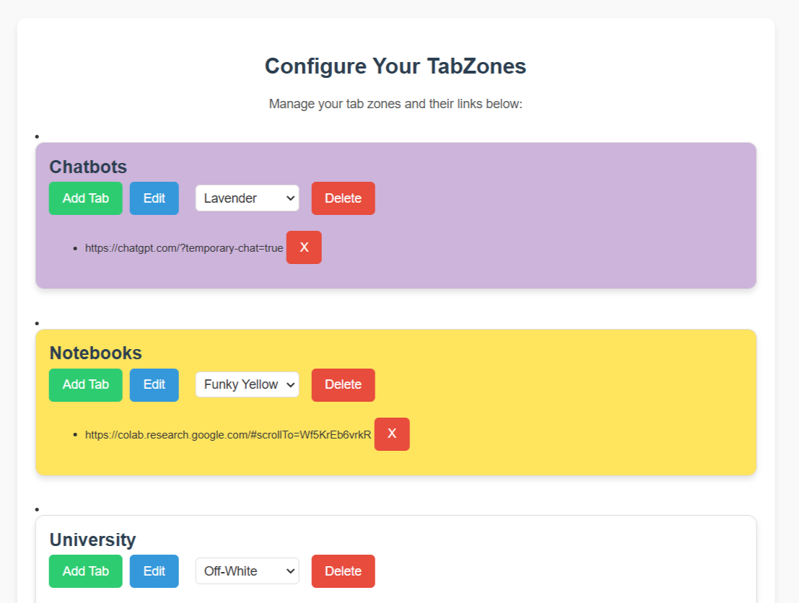
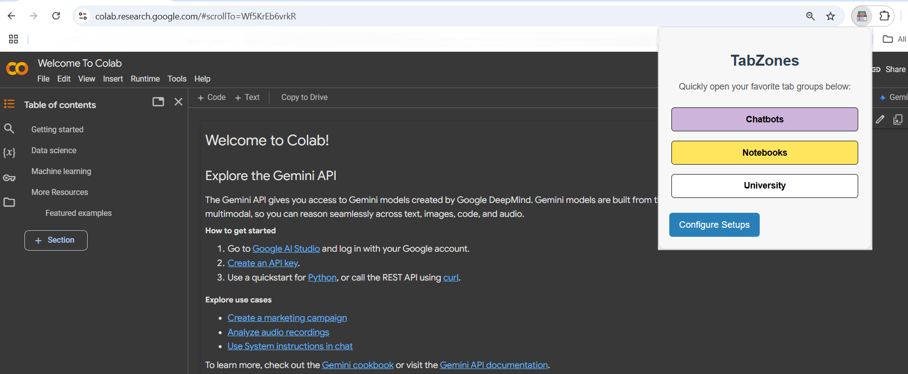
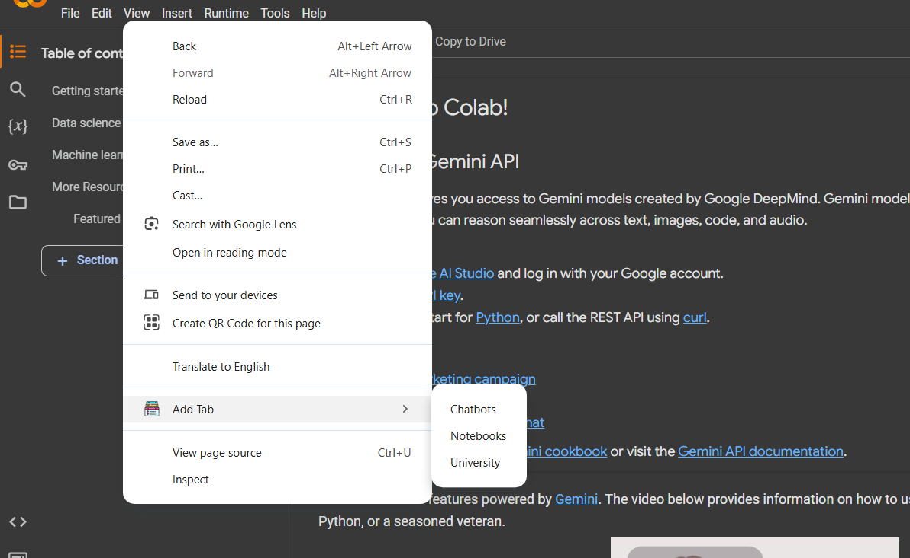

# TabZones Chrome Extension  

Do you ever find yourself opening the same tabs every time you sit down to work or study? Dictionary? Reference book? ChatGPT? Yeah, me too. It was driving me crazy! So, I decided to solve this once and for all with **TabZones**, my productivity game-changer.  

With TabZones, you can group your favorite tabs into zones like "Study" or "Job Hunt" and open them all with a single click. It’s like having your personal productivity toolkit at your fingertips. Plus, adding new tabs to your zones is ridiculously easy. Whether through the popup or a quick right-click menu, it’s all about making your workflow seamless.  

I made this extension because I needed it. I’m an engineer, after all—it’s what we do! Now it’s here for you, and I hope it becomes your new superpower too. Let me know what you think—seriously, I’d love your feedback! ([LinkedIn](https://www.linkedin.com/in/devashishtambade/))

---
## 🚀 New Update!!! (v1.2) 🎉

I'm excited to bring you the latest update based on your feedback! 🌟 In this version, I’ve **introduced dark mode** for a sleek and modern experience. 🌙✨ Plus, I’ve added an awesome **export/import feature**! 🔄 Now you can easily **share your tabzones with friends** or even with the world, and import exclusive setups to level up your own! 🌍🎉 I’ve also squashed some bugs and fixed issues to ensure smoother performance and a better overall experience. 🙌 I hope these updates make your browsing even more efficient and fun!

---
## 🔧 How to Use TabZones  

### 1️⃣ Get Started  
1. Clone or download this repository.  
2. Open Chrome and head over to `chrome://extensions/`.  
3. Enable **Developer mode** (toggle in the top right).  
4. Click **Load unpacked** and select the TabZones extension folder.  

### 2️⃣ Set Up Your Zones  
1. Open the extension’s popup and click **Configure Setup**.  
2. Create a new zone, give it a name (like "Study Time"), and add your URLs.  
   - Example: Want ChatGPT, an online dictionary, and a reference book? Add them all here!  

  

### 3️⃣ Open Your Zones  
Click the extension icon and select a zone—boom, all your tabs are ready to go.  

  

### 4️⃣ Add Tabs On the Fly  
Need to add a tab to a zone while browsing? Just right-click anywhere on the page, go to **"Add Tab"**, and choose the zone—it’s that easy.  

  

---

## 🤝 Contributions  

Got ideas? Found a bug? Think you can improve TabZones?  
Any and all contributions are welcome!  

---

## 🌟 Why I Built This  

I got tired of wasting time setting up the same tabs every time I wanted to work or study. I thought, "There’s got to be a better way." So I built one! TabZones has changed how I work, and I’m excited for it to do the same for you.  

---

## 📬 Connect With Me  

I’d love to hear your thoughts or suggestions! Feel free to reach out on LinkedIn:  
([Mr. Devashish Tambade](https://www.linkedin.com/in/devashishtambade/))  
